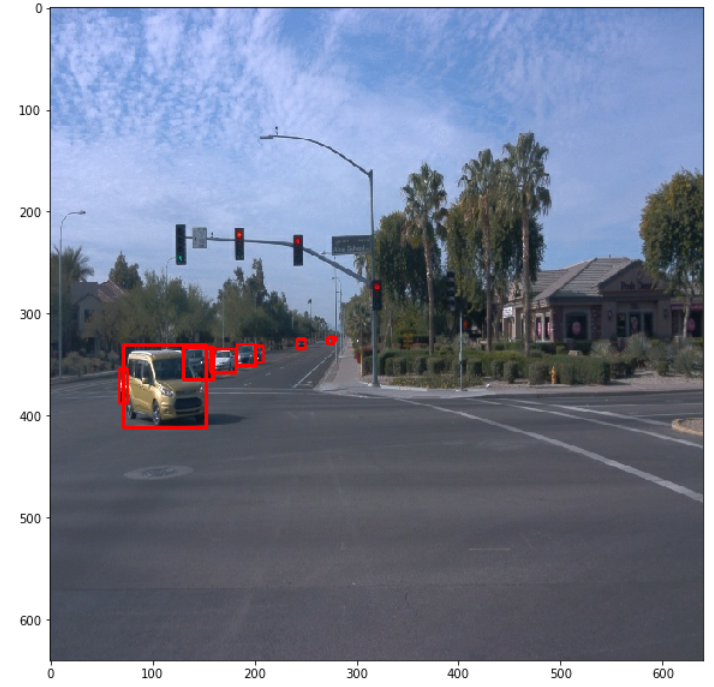
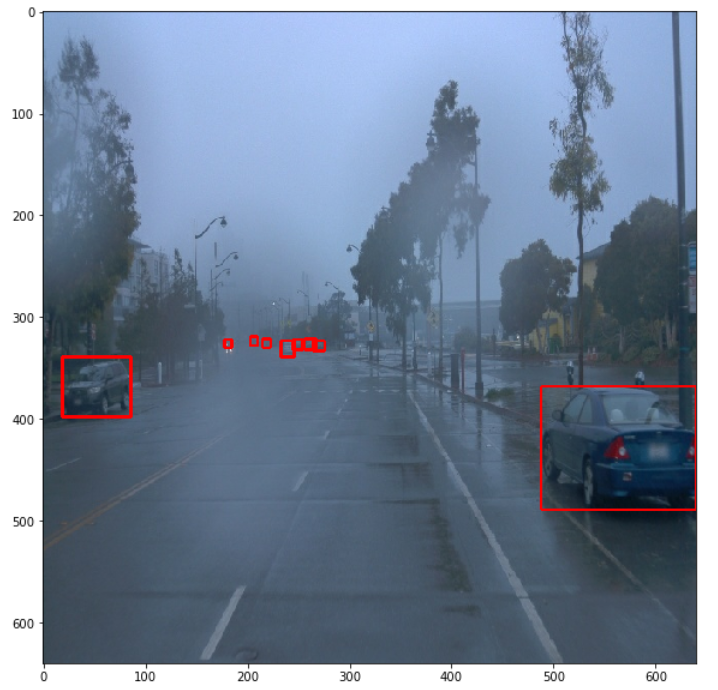
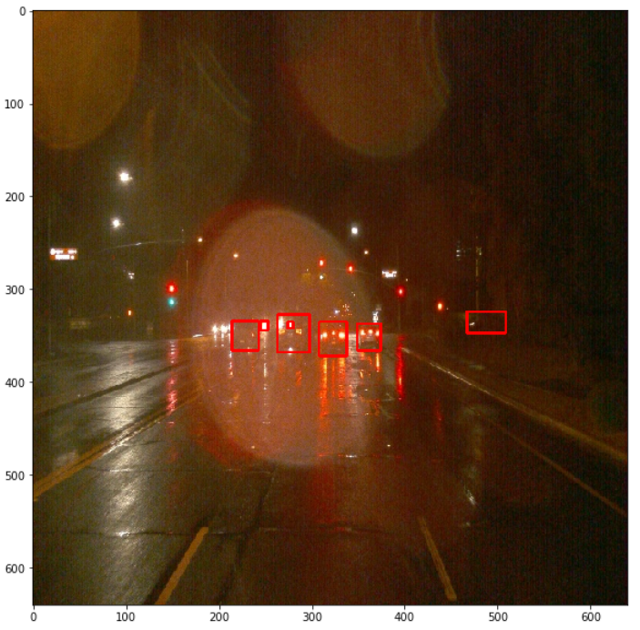
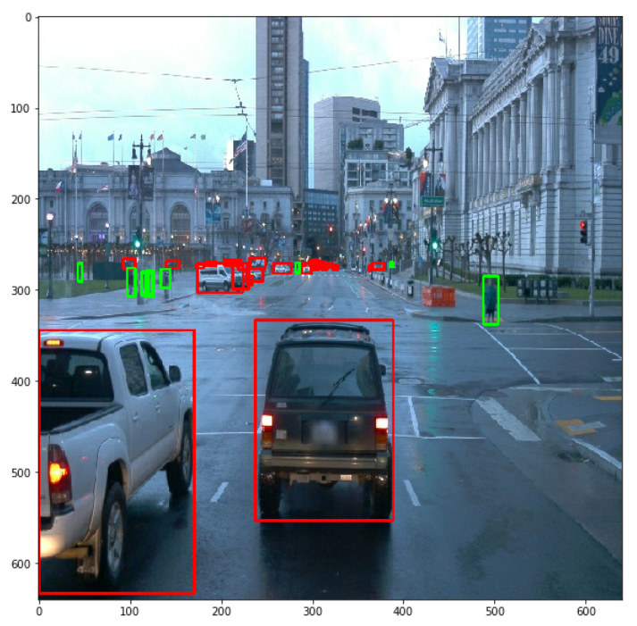
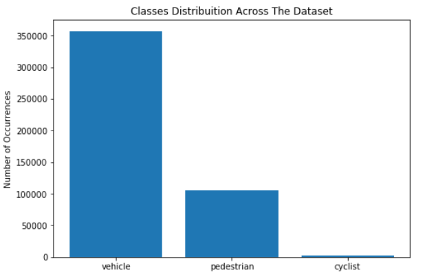

# Object Detection in an Urban Environment

## Data

For this project, we will be using data from the [Waymo Open dataset](https://waymo.com/open/).

[OPTIONAL] - The files can be downloaded directly from the website as tar files or from the [Google Cloud Bucket](https://console.cloud.google.com/storage/browser/waymo_open_dataset_v_1_2_0_individual_files/) as individual tf records. We have already provided the data required to finish this project in the workspace, so you don't need to download it separately.

## Structure

### Data

The data you will use for training, validation and testing is organized as follow:
```
/home/workspace/data/waymo
    - training_and_validation - contains 97 files to train and validate your models
    - train: contain the train data (empty to start)
    - val: contain the val data (empty to start)
    - test - contains 3 files to test your model and create inference videos
```

The `training_and_validation` folder contains file that have been downsampled: we have selected one every 10 frames from 10 fps videos. The `testing` folder contains frames from the 10 fps video without downsampling.

You will split this `training_and_validation` data into `train`, and `val` sets by completing and executing the `create_splits.py` file.

### Experiments
The experiments folder will be organized as follow:
```
experiments/
    - pretrained_model/
    - exporter_main_v2.py - to create an inference model
    - model_main_tf2.py - to launch training
    - reference/ - reference training with the unchanged config file
    - experiment0/ - create a new folder for each experiment you run
    - experiment1/ - create a new folder for each experiment you run
    - experiment2/ - create a new folder for each experiment you run
    - label_map.pbtxt
    ...
```

## Prerequisites

### Local Setup

For local setup if you have your own Nvidia GPU, you can use the provided Dockerfile and requirements in the [build directory](./build).

Follow [the README therein](./build/README.md) to create a docker container and install all prerequisites.

### Download and process the data

**Note:** ”If you are using the classroom workspace, we have already completed the steps in the section for you. You can find the downloaded and processed files within the `/home/workspace/data/preprocessed_data/` directory. Check this out then proceed to the **Exploratory Data Analysis** part.

The first goal of this project is to download the data from the Waymo's Google Cloud bucket to your local machine. For this project, we only need a subset of the data provided (for example, we do not need to use the Lidar data). Therefore, we are going to download and trim immediately each file. In `download_process.py`, you can view the `create_tf_example` function, which will perform this processing. This function takes the components of a Waymo Tf record and saves them in the Tf Object Detection api format. An example of such function is described [here](https://tensorflow-object-detection-api-tutorial.readthedocs.io/en/latest/training.html#create-tensorflow-records). We are already providing the `label_map.pbtxt` file.

You can run the script using the following command:
```
python download_process.py --data_dir {processed_file_location} --size {number of files you want to download}
```

You are downloading 100 files (unless you changed the `size` parameter) so be patient! Once the script is done, you can look inside your `data_dir` folder to see if the files have been downloaded and processed correctly.

### Classroom Workspace

In the classroom workspace, every library and package should already be installed in your environment. You will NOT need to make use of `gcloud` to download the images.

## Instructions

### Exploratory Data Analysis

You should use the data already present in `/home/workspace/data/waymo` directory to explore the dataset! This is the most important task of any machine learning project. To do so, open the `Exploratory Data Analysis` notebook. In this notebook, your first task will be to implement a `display_instances` function to display images and annotations using `matplotlib`. This should be very similar to the function you created during the course. Once you are done, feel free to spend more time exploring the data and report your findings. Report anything relevant about the dataset in the writeup.

Keep in mind that you should refer to this analysis to create the different spits (training, testing and validation).


### Create the training - validation splits
In the class, we talked about cross-validation and the importance of creating meaningful training and validation splits. For this project, you will have to create your own training and validation sets using the files located in `/home/workspace/data/waymo`. The `split` function in the `create_splits.py` file does the following:
* create three subfolders: `/home/workspace/data/train/`, `/home/workspace/data/val/`, and `/home/workspace/data/test/`
* split the tf records files between these three folders by symbolically linking the files from `/home/workspace/data/waymo/` to `/home/workspace/data/train/`, `/home/workspace/data/val/`, and `/home/workspace/data/test/`

Use the following command to run the script once your function is implemented:
```
python create_splits.py --data-dir /home/workspace/data
```

### Edit the config file

Now you are ready for training. As we explain during the course, the Tf Object Detection API relies on **config files**. The config that we will use for this project is `pipeline.config`, which is the config for a SSD Resnet 50 640x640 model. You can learn more about the Single Shot Detector [here](https://arxiv.org/pdf/1512.02325.pdf).

First, let's download the [pretrained model](http://download.tensorflow.org/models/object_detection/tf2/20200711/ssd_resnet50_v1_fpn_640x640_coco17_tpu-8.tar.gz) and move it to `/home/workspace/experiments/pretrained_model/`.

We need to edit the config files to change the location of the training and validation files, as well as the location of the label_map file, pretrained weights. We also need to adjust the batch size. To do so, run the following:
```
python edit_config.py --train_dir /home/workspace/data/train/ --eval_dir /home/workspace/data/val/ --batch_size 2 --checkpoint /home/workspace/experiments/pretrained_model/ssd_resnet50_v1_fpn_640x640_coco17_tpu-8/checkpoint/ckpt-0 --label_map /home/workspace/experiments/label_map.pbtxt
```
A new config file has been created, `pipeline_new.config`.

### Training

You will now launch your very first experiment with the Tensorflow object detection API. Move the `pipeline_new.config` to the `/home/workspace/experiments/reference` folder. Now launch the training process:
* a training process:
```
python experiments/model_main_tf2.py --model_dir=experiments/reference/ --pipeline_config_path=experiments/reference/pipeline_new.config
```
Once the training is finished, launch the evaluation process:
* an evaluation process:
```
python experiments/model_main_tf2.py --model_dir=experiments/reference/ --pipeline_config_path=experiments/reference/pipeline_new.config --checkpoint_dir=experiments/reference/
```

**Note**: Both processes will display some Tensorflow warnings, which can be ignored. You may have to kill the evaluation script manually using
`CTRL+C`.

To monitor the training, you can launch a tensorboard instance by running `python -m tensorboard.main --logdir experiments/reference/`. You will report your findings in the writeup.

### Improve the performances

Most likely, this initial experiment did not yield optimal results. However, you can make multiple changes to the config file to improve this model. One obvious change consists in improving the data augmentation strategy. The [`preprocessor.proto`](https://github.com/tensorflow/models/blob/master/research/object_detection/protos/preprocessor.proto) file contains the different data augmentation method available in the Tf Object Detection API. To help you visualize these augmentations, we are providing a notebook: `Explore augmentations.ipynb`. Using this notebook, try different data augmentation combinations and select the one you think is optimal for our dataset. Justify your choices in the writeup.

Keep in mind that the following are also available:
* experiment with the optimizer: type of optimizer, learning rate, scheduler etc
* experiment with the architecture. The Tf Object Detection API [model zoo](https://github.com/tensorflow/models/blob/master/research/object_detection/g3doc/tf2_detection_zoo.md) offers many architectures. Keep in mind that the `pipeline.config` file is unique for each architecture and you will have to edit it.

**Important:** If you are working on the workspace, your storage is limited. You may to delete the checkpoints files after each experiment. You should however keep the `tf.events` files located in the `train` and `eval` folder of your experiments. You can also keep the `saved_model` folder to create your videos.


### Creating an animation
#### Export the trained model
Modify the arguments of the following function to adjust it to your models:

```
python experiments/exporter_main_v2.py --input_type image_tensor --pipeline_config_path experiments/reference/pipeline_new.config --trained_checkpoint_dir experiments/reference/ --output_directory experiments/reference/exported/
```

This should create a new folder `experiments/reference/exported/saved_model`. You can read more about the Tensorflow SavedModel format [here](https://www.tensorflow.org/guide/saved_model).

Finally, you can create a video of your model's inferences for any tf record file. To do so, run the following command (modify it to your files):
```
python inference_video.py --labelmap_path label_map.pbtxt --model_path experiments/reference/exported/saved_model --tf_record_path /data/waymo/testing/segment-12200383401366682847_2552_140_2572_140_with_camera_labels.tfrecord --config_path experiments/reference/pipeline_new.config --output_path animation.gif
```

## Submission Template

### Project overview

This repository is for `Udacity Self Driving Car Engineer Nanodegree` project.

This project's goal is to develop an object detection model for a self-driving car. Object detection is such an important component of the self-driving car system because it allows the car to understand its surroundings and plan accordingly.

This project have several steps as below:

1. Download the `Waymo Open Dataset`
2. Exploratory Data Analysis: known our dataset
3. Split dataset: split data into three groups (train, validatin and test)
4. Traning and validation: which have many different experiments to try to improve the performance of the model

### Set up

For local setup if you have your own Nvidia GPU, you can use the provided Dockerfile and requirements in the [build folder](https://github.com/kaka-lin/nd013-c1-vision-starter/tree/main/build).

For convenience and rapidly use, supply two scripta for build and run the image, as below:

```bash
$ chmod +x build.sh
$ chmod +x run.sh
```

#### Build the image

```bash
$ ./build.sh
```

#### Run the image

```bash
$ ./run.sh
```

### Dataset

The tfrecords have images of various enviroment conditions (sunny, rainy, fog, cloud, day, night etc).

#### Downloading and processing the data

Before you download dataset, you need to login, as below:

```bash
$ gcloud auth login
```

Run the following command to download and process the data:

```bash
$ python download_process.py --data_dir data
```

#### Dataset analysis

The dataset contains 1997 images, split across 100 files. Each file contains ~20 images, which are taken from the same journey. These journeys were made in various day and weather conditions as shown in the images below:

<p float="left" align="middle">
  
  
  
  
</p>

##### Class Distribution Analysis

The images are annotated with 3 classes: pedestrian, vehicle and cyclist. However, these classes are not equally represented in the dataset:




#### Creating the splits

A split of `75% training, 15% validation and 10% testing` of files is used. This is selected to have the most proportion of training files, but also to avoid overfitting the data.

To create the splits, run the following command:

```
$ python create_splits.py --source data/processed --destination data
```

### Training

To train the model, run the following command:

- training with reference config

    ```bash
    $ python experiments/model_main_tf2.py --model_dir=experiments/reference/ --pipeline_config_path=experiments/reference/pipeline_new.config
    ```
- training with experiment config

    ```bash
    # change <cnt> to your experiment number, like: 1, 2, ...
    $ python experiments/model_main_tf2.py --model_dir=experiments/experiment_<cnt>/ --pipeline_config_path=experiments/experiment_<cnt>/pipeline_new.config
    ```

#### Reference experiment

We use `SSD Resnet50 640x640` model and train it with pre-trained weight. And the configuration file is the one generated based on `pipeline.config`.

<p float="left" align="middle">
  
  
  
  
</p>

At 24,000 steps, the reference model achieved the following metrics on the validation set:

| mAP | mAP (large) | mAP (medium) | mAP (small) | mAP (@.5 IOU) | mAP (@.75 IOU) |
|----------- | ----------- | ----------- | ----------- | ----------- | ----------- |
|  0.0761 | 0.2539 | 0.2177 | 0.0337 | 0.1473 | 0.0714 |


| AR@1 | AR@10 | AR@100 | AR@100 (large) | AR@100 (medium) | AR@100 (small) |
|------|------|------|------|------|------|
| 0.0211 | 0.0923 | 0.14158 | 0.325 | 0.3513 | 0.0832 |

#### Improve on the reference

Several experiments were conducted to improve the on the reference. The following table summaries the changes (from the reference) made in some of these experiments:

| Experiment | Changes from reference|
|------------|-----------------------|
| Experiment 1 | Learning rate: Exponential decay|
| Experiment 2 | Augmentation: Randomly convert entire image to grey scale. <br />Learning rate: Exponential decay |

Why these experiments improve the performance of the model:

- `random_rgb_to_gray`:

    This could be useful to `not rely on colored images`, *can remove some of the variations caused by the different lighting conditions, like at night*.

- `initial_learning_rate`:

    Using *0.001* to be initial learning rate rather than *0.04* which helps training converge.

- `exponential_decay_learning_rate`:

    Using an `exponential decay learning rate`, rather than a cosine learning rate. More information about learning rates can be found [here](https://github.com/tensorflow/models/blob/master/research/object_detection/protos/optimizer.proto).

The table below summaries the results of the 2 experiments that had a noticeable improvement over the reference:

| Experiment | mAP | mAP (large) | mAP (medium) | mAP (small) | mAP (@.5 IOU) | mAP (@.75 IOU) |
|------------|----------- | ----------- | ----------- | ----------- | ----------- | ----------- |
| Reference  | 0.0761 | 0.2539 | 0.2177 | 0.0337 | 0.1473 | 0.0714 |
| Experiment 1 | 0.1519 | 0.4356 | 0.4492 | 0.074792 | 0.2914 | 0.13766 |
| Experiment 2 | 0.1659 | 0.7454 | 0.4538 | 0.082638 | 0.3115 | 0.15221 |

| Experiment | AR@1 | AR@10 | AR@100 | AR@100 (large) | AR@100 (medium) | AR@100 (small) |
|------|------|------|------|------|------|------|
| Reference | 0.0211 | 0.0923 | 0.14158 | 0.325 | 0.3513 | 0.0832 |
| Experiment 1 | 0.04145 | 0.162992 | 0.219177 | 0.8128 | 0.5164 | 0.14509
| Experiment 2 | 0.04342 | 0.168343 | 0.227448 | 0.7649 | 0.510043 | 0.154307 |

##### Experiment 1

<p float="left" align="middle">
  
  
  
  
</p>


##### Experiment 2

<p float="left" align="middle">
  
  
  
  
</p>

The following GIF, shows the model's inference:


